# Plot showcase: clumping factors, IGM definitions, and current results

This document is a plot-first record of the project so far. It follows the
scientific progression from the first density-clumping calculations to the more
physical ionization, recombination, forest, and dark-matter-model comparisons.

The central idea running through all figures is that a "clumping factor" is not
one unique number. It depends on the matter component, the averaging measure, the
IGM selection, and the physical quantity placed in the numerator.

```text
Baseline density clumping:

C = <rho^2> / <rho>^2
```

The early project measured this density statistic. The later project asks how
that baseline changes when we move toward gas volumes, ionization state,
recombination rates, mean free paths, photoionization rates, and observationally
motivated IGM definitions.

## How the method comparisons should be read

The figures are grouped by the physical question they answer. The most important
comparison is not "which code path is faster?" but "which definition of the IGM
or gas field is being measured?"

| Comparison axis | What changes physically | How to read the plots |
|---|---|---|
| Gas vs dark matter | Baryons respond to pressure, cooling, radiation, and ionization; dark matter traces collisionless structure. | Similar trends show shared structure growth; differences point to baryonic physics. |
| Gridded gas vs raw-volume gas | Gridded methods measure a smoothed field on a uniform mesh; raw-volume uses native moving-mesh gas-cell volumes. | If raw-volume is higher, dense native cells matter more than in the smoothed grid estimator. |
| Sphere vs Pylians | Two implementations of nearly the same gridded density statistic. | Agreement is a validation of the density estimator, not a new physical definition. |
| Threshold sweeps | The IGM boundary moves as `Delta_th` changes. | A single threshold can hide definition dependence; curves show how sensitive the result is to IGM selection. |
| Grid-size comparisons | The analysis scale changes. | Stable curves indicate convergence; large shifts mean the statistic still depends on numerical resolution. |
| Ionized sweeps | The selected gas is filtered by ionization state instead of density alone. | These plots are closer to reionization physics than pure density clumping. |
| Equation diagnostics | The numerator changes from `rho^2` to hydrogen, electron, photon, recombination, or MFP-related quantities. | These plots explain which physical field drives the final clumping-like quantity. |
| Model comparisons | The simulation physics changes between CDM, WDM, SIDM, and vSIDM. | Relative-to-CDM plots are usually more informative than absolute curves because they remove common structure growth. |

The layout below keeps related figures side by side when possible. In each group,
read horizontally first: the point is to compare methods under the same physical
question before moving to the next section.

## 1. The main Thesan-2 density-clumping story

The first complete scientific picture is the redshift evolution of density
clumping in Thesan-2. These plots show that the density field becomes more
inhomogeneous as structure grows, and that the measured amplitude depends on
whether the gas is analyzed on a grid or on native gas-cell volumes.

<table>
<tr>
<td align="center">
<strong>Primary redshift evolution at fixed threshold</strong><br>
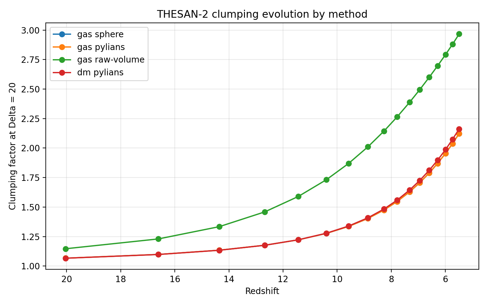
</td>
</tr>
</table>

At fixed overdensity threshold `Delta_th = 20`, the clumping factor rises
steadily from high redshift to lower redshift. This is the cleanest summary of
the basic physical trend: structure formation drives the matter distribution
away from uniformity.

<table>
<tr>
<td width="50%" align="center">
<strong>Threshold dependence over redshift</strong><br>

</td>
<td width="50%" align="center">
<strong>Estimator dependence over overdensity</strong><br>
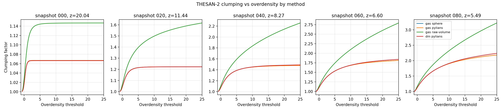
</td>
</tr>
</table>

The threshold panels show that this conclusion is not tied to only one density
cut. Higher thresholds include denser gas and therefore allow larger clumping
values. This is why the project moved from a single number to threshold sweeps.

This plot is the best visual summary of the method dependence. At the same
redshift, the inferred clumping depends on the estimator. That is a physics
lesson, not just a software detail: the definition controls which structures
count as part of the IGM and how strongly dense regions are weighted.

Representative `C20` values:

| Snapshot | Redshift | Gas sphere | Gas raw-volume | DM Pylians |
|---:|---:|---:|---:|---:|
| 000 | 20.042 | 1.067 | 1.147 | 1.066 |
| 020 | 11.436 | 1.223 | 1.590 | 1.223 |
| 040 | 8.268 | 1.475 | 2.144 | 1.484 |
| 060 | 6.597 | 1.789 | 2.600 | 1.812 |
| 080 | 5.491 | 2.123 | 2.967 | 2.163 |

## 2. Gas-only views: grid versus native gas volumes

The gas figures isolate one of the most important choices made in the project:
whether to reconstruct gas on a regular grid or to use the native moving-mesh
cell volumes.

<table>
<tr>
<td width="33%" align="center">
<strong>Gas sphere</strong><br>

</td>
<td width="33%" align="center">
<strong>Gas Pylians</strong><br>

</td>
<td width="33%" align="center">
<strong>Gas raw-volume</strong><br>
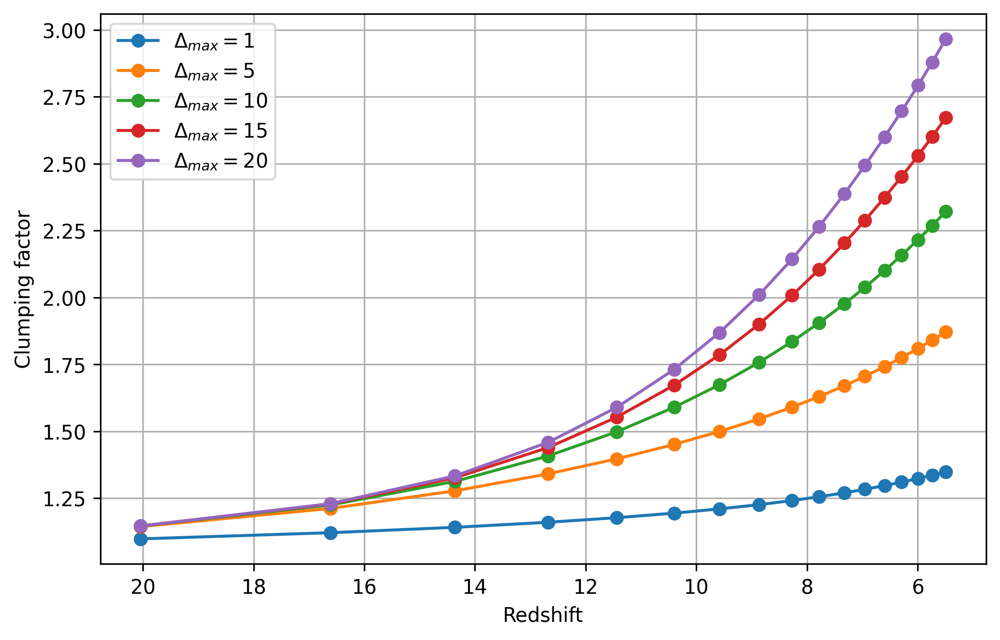
</td>
</tr>
</table>

The spherical smoothing path gives a stable gridded gas-density statistic. This
was one of the first mature versions of the calculation: density is deposited to
a mesh, smoothed, and then thresholded by overdensity.

The Pylians result closely tracks the custom gridded calculation for the same
statistic. This agreement was a key validation step: the density trend is not an
artifact of only one implementation.

The raw-volume estimator is larger. This is physically meaningful because it
uses native gas-cell volumes rather than replacing the moving-mesh volume
measure with a uniform analysis grid. The difference is one of the clearest
reasons to keep multiple definitions visible.

<table>
<tr>
<td width="33%" align="center">
<strong>Sphere threshold sweep</strong><br>

</td>
<td width="33%" align="center">
<strong>Pylians threshold sweep</strong><br>
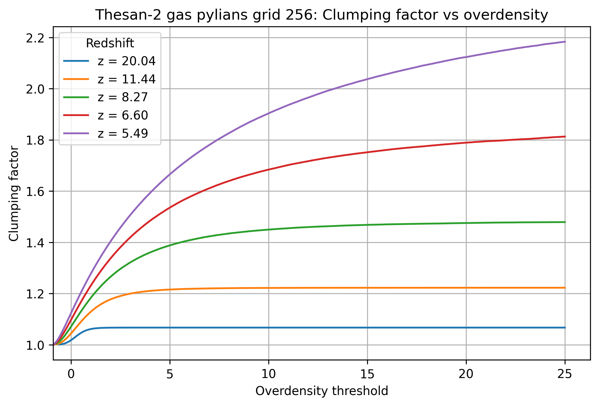
</td>
<td width="33%" align="center">
<strong>Raw-volume threshold sweep</strong><br>

</td>
</tr>
</table>

Together, these three threshold-sweep plots show the same core lesson from
three angles: the redshift trend is robust, but the amplitude depends on the
gas-density definition and averaging measure.

## 3. Dark-matter clumping as the baseline structure tracer

Dark matter is the clean collisionless structure tracer. Its clumping evolution
is therefore the baseline against which gas physics can be compared.

<table>
<tr>
<td width="33%" align="center">
<strong>DM redshift evolution</strong><br>
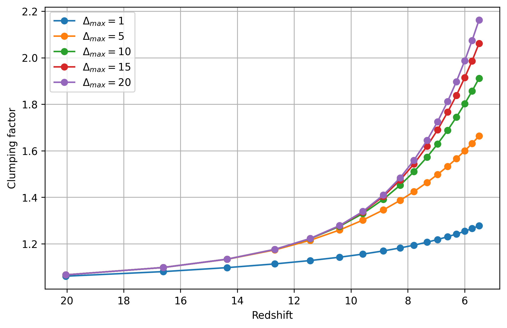
</td>
<td width="33%" align="center">
<strong>DM threshold sweep</strong><br>
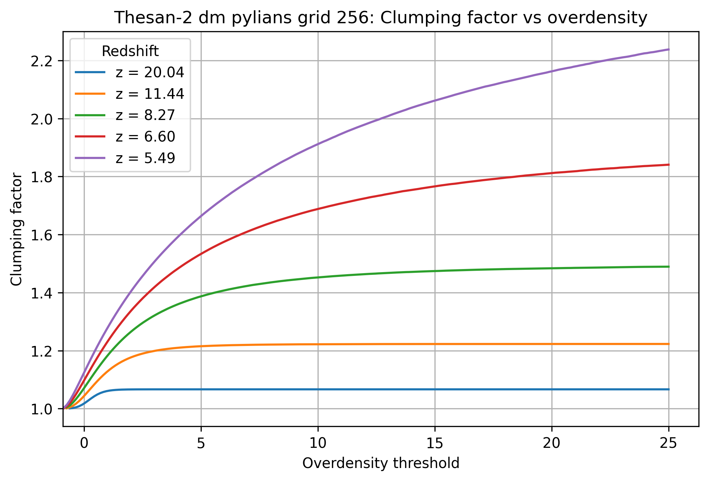
</td>
<td width="33%" align="center">
<strong>DM grid-size comparison</strong><br>

</td>
</tr>
</table>

The DM clumping factor grows in the same broad direction as gas clumping, but it
does not encode gas pressure, cooling, ionization, or recombination physics.
This is why gas and dark matter were kept separate from the beginning.

The overdensity sweep shows how much of the inferred clumping comes from the
choice of IGM cut. The threshold is part of the physical definition, not a
cosmetic plotting parameter.

This grid-size comparison is one of the checks that the density statistic is
not dominated by one arbitrary mesh resolution. Resolution dependence remains a
systematic to report, but this plot is the reason the grid-based campaign became
usable for scientific comparison.

## 4. Snapshot 080 as the main method-comparison anchor

Snapshot 080 at `z = 5.491` became the main comparison point because many
definitions were run there. It is late enough for clumping to be visible and
still relevant to reionization-era IGM physics.

| Method | `C5` | `C10` | `C20` |
|---|---:|---:|---:|
| Gas sphere, grid 256 | 1.665 | 1.903 | 2.123 |
| Gas Pylians, grid 256 | 1.665 | 1.903 | 2.123 |
| Gas raw-volume | 1.872 | 2.322 | 2.967 |
| DM Pylians, grid 256 | 1.664 | 1.912 | 2.163 |

The plot story is simple: when two methods implement the same gridded statistic,
they agree; when the estimator changes to native gas-cell volume weighting, the
answer changes. That difference is part of the science.

## 5. From density clumping to ionization-aware clumping

The next group of figures marks the transition from density-only clumping to
IGM physics. Density clumping measures `rho`. Reionization observables depend on
hydrogen ionization, electron density, recombination rates, radiation fields,
and mean free paths.

The more physical recombination-style quantity is closer to

```text
C_rec,F =
    <alpha(T) n_HII n_e F>_V
    / (<alpha(T)>_V <n_HII>_V <n_e>_V <F>_V)
```

where `F` can represent a soft transmission or IGM-selection field. This is not
the same quantity as `<rho^2>/<rho>^2`.

<table>
<tr>
<td width="50%" align="center">
<strong>C13 and c-tilde ionized sweep</strong><br>
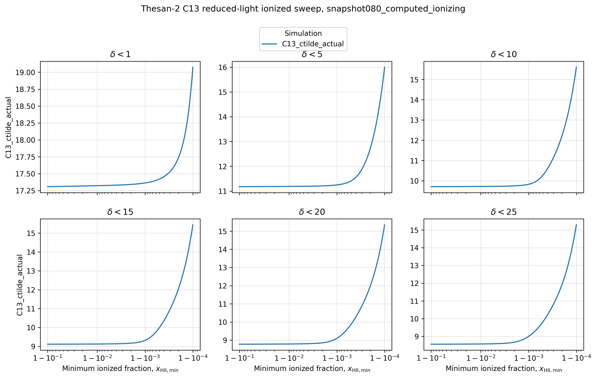
</td>
<td width="50%" align="center">
<strong>Raw-volume ionized sweep</strong><br>

</td>
</tr>
</table>

This plot group is one of the clearest signs that the project moved beyond a
mass-density statistic. The ionized fraction cut changes the inferred
clumping-like quantities because it changes which gas participates in the
ionized IGM calculation.

The raw-volume ionized sweep keeps the native gas-volume logic while adding an
ionization selection. This is closer in spirit to a physical IGM statistic than
the original gridded density threshold.

## 6. Full equation diagnostics

The full diagnostic set decomposes the ionization-aware calculation into the
quantities that drive it. These figures are useful because they show where the
final clumping-like number comes from physically.

<table>
<tr>
<td width="33%" align="center">
<strong>C5 raw-volume overdensity</strong><br>
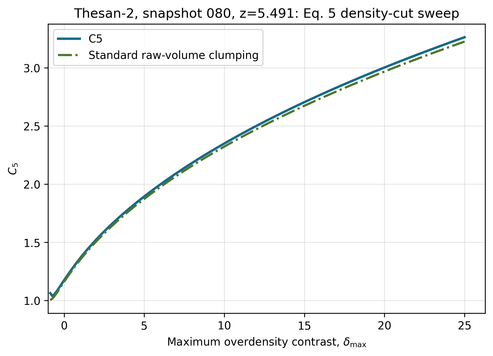
</td>
<td width="33%" align="center">
<strong>Clumping and ionization</strong><br>

</td>
<td width="33%" align="center">
<strong>Photon-group C13</strong><br>

</td>
</tr>
</table>

This is the bridge from the old density-clumping language to the newer
equation-based diagnostics. It keeps the familiar overdensity axis but begins
to connect it to the paper-inspired quantities.

These panels show that clumping and ionization selection are intertwined. Dense
gas is not automatically the gas that should dominate a reionization-relevant
statistic.

The photon-group comparison matters because THESAN radiation is not a single
monochromatic field. The physical interpretation of transmission or ionization
weights depends on which radiation group is being used.

<table>
<tr>
<td width="25%" align="center">
<strong>nH volume</strong><br>

</td>
<td width="25%" align="center">
<strong>nHI volume</strong><br>

</td>
<td width="25%" align="center">
<strong>nHII volume</strong><br>

</td>
<td width="25%" align="center">
<strong>Electron density</strong><br>

</td>
</tr>
</table>

These four plots separate the hydrogen and electron-density ingredients. This
is the key physical decomposition missing from density-only clumping.

<table>
<tr>
<td width="33%" align="center">
<strong>Photon density</strong><br>
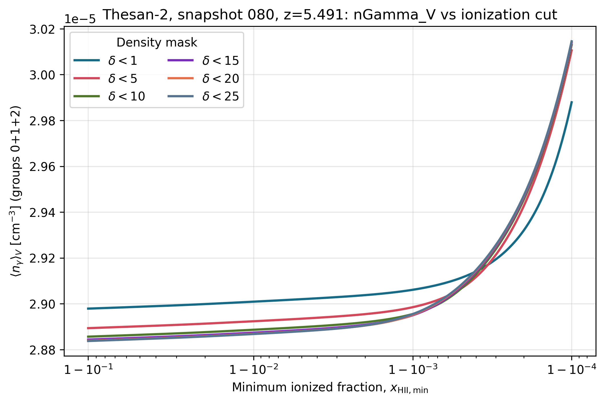
</td>
<td width="33%" align="center">
<strong>Recombination rate</strong><br>

</td>
<td width="33%" align="center">
<strong>Ionization rate</strong><br>
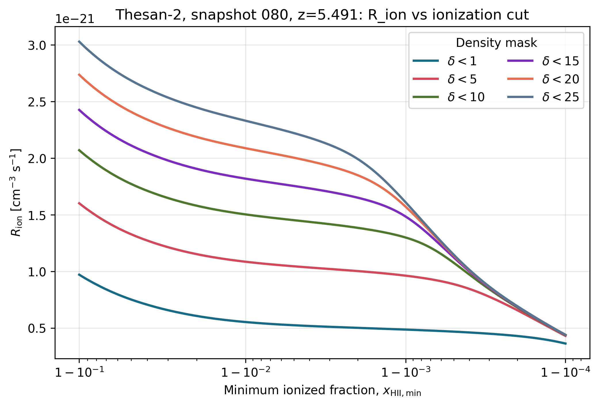
</td>
</tr>
</table>

These panels move the analysis from density fields into rate fields. That is
the conceptual step needed before comparing to reionization observables.

<table>
<tr>
<td width="33%" align="center">
<strong>Gamma and c-tilde</strong><br>
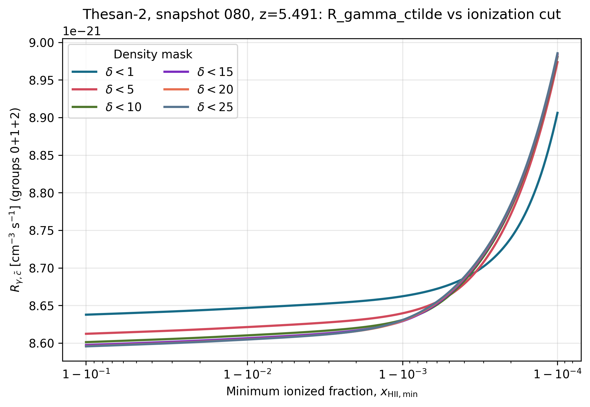
</td>
<td width="33%" align="center">
<strong>Q6</strong><br>
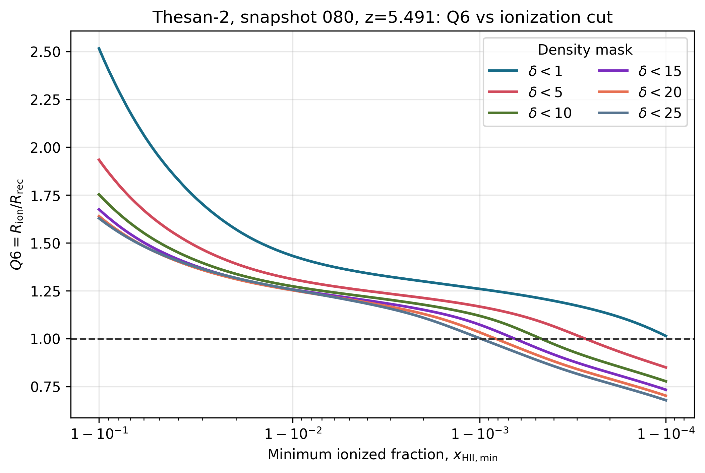
</td>
<td width="33%" align="center">
<strong>MFP and nHI</strong><br>
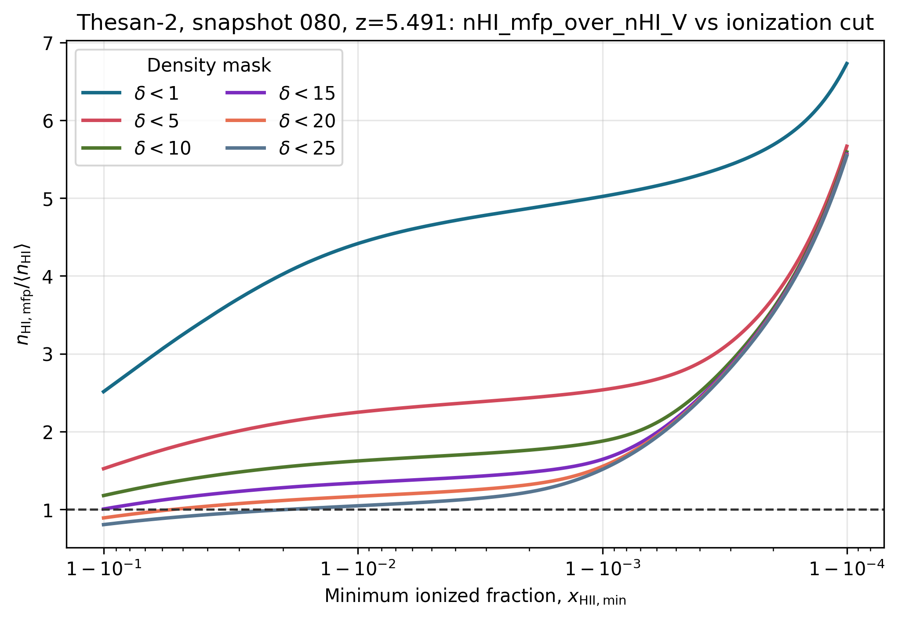
</td>
</tr>
<tr>
<td width="33%" align="center">
<strong>Q12 and c-tilde</strong><br>
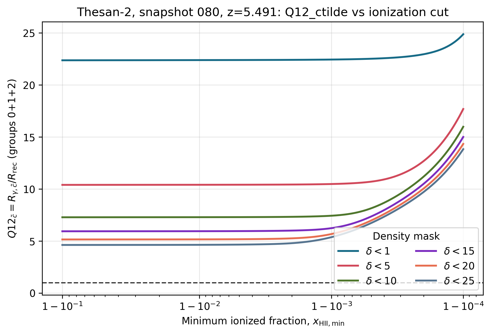
</td>
<td width="33%" align="center">
<strong>nGamma c-tilde sigma / Gamma</strong><br>

</td>
<td width="33%" align="center">
<strong>Equation diagnostics summary</strong><br>
These panels connect clumping to radiation, MFP, and effective ionization terms.
</td>
</tr>
</table>

The later diagnostics connect the clumping calculation to Gamma, mean free path,
and effective radiation factors. This is the beginning of the observational
bridge: the calculation is no longer only asking how lumpy the gas is, but how
that lumpiness enters reionization equations.

For snapshot 080, the equation-test output labelled `C5_paper_actual` gives:

| Threshold | `C5_paper_actual` |
|---:|---:|
| 1 | 1.364 |
| 5 | 1.894 |
| 10 | 2.350 |
| 20 | 3.003 |
| 25 | 3.264 |

## 7. AIDA-TNG: raw-volume dark-matter-model plot gallery

The AIDA-TNG figures move the project toward its original objective: comparing
clumping predictions across dark matter models. For these comparisons the
showcase uses the raw-volume gas estimator, because it keeps the native
moving-mesh volume weighting and is the more physical gas-volume statistic.

<table>
<tr>
<td width="50%" align="center">
<strong>L35n1080 snapshot 017: raw-volume clumping</strong><br>
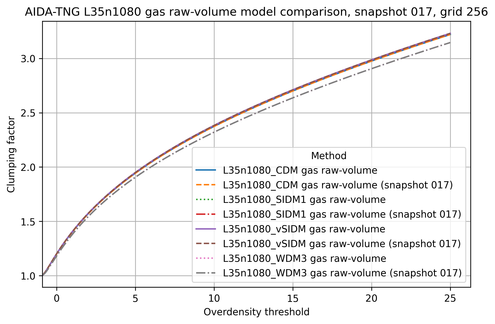
</td>
<td width="50%" align="center">
<strong>L35n1080 snapshot 017: relative to CDM</strong><br>
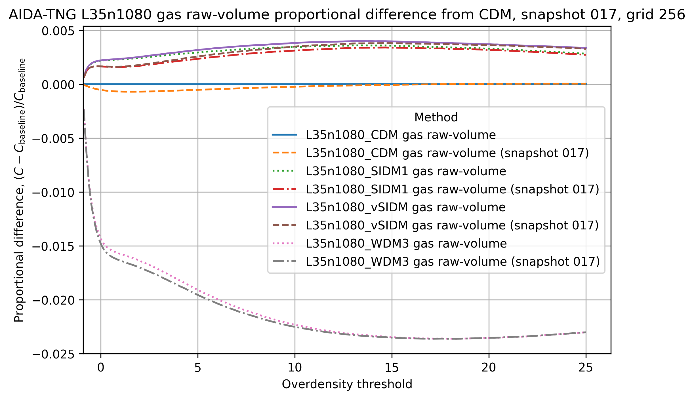
</td>
</tr>
</table>

At `z ~ 5`, the gas-density clumping differences between the L35n1080
models are modest. That is already scientifically useful: the simplest density
statistic may not be the most sensitive discriminator.

<table>
<tr>
<td width="50%" align="center">
<strong>L35n1080 snapshot 099: raw-volume clumping</strong><br>
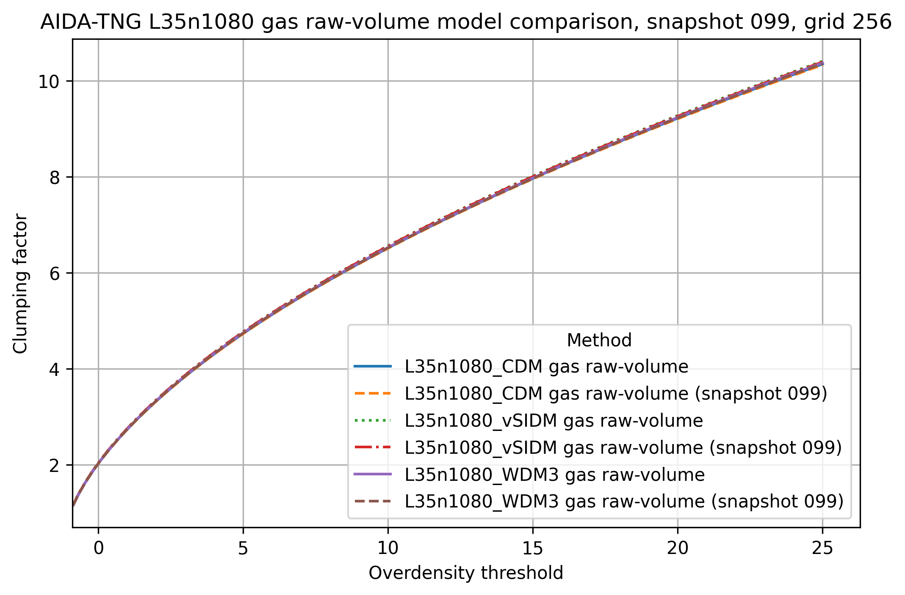
</td>
<td width="50%" align="center">
<strong>L35n1080 snapshot 099: relative to CDM</strong><br>
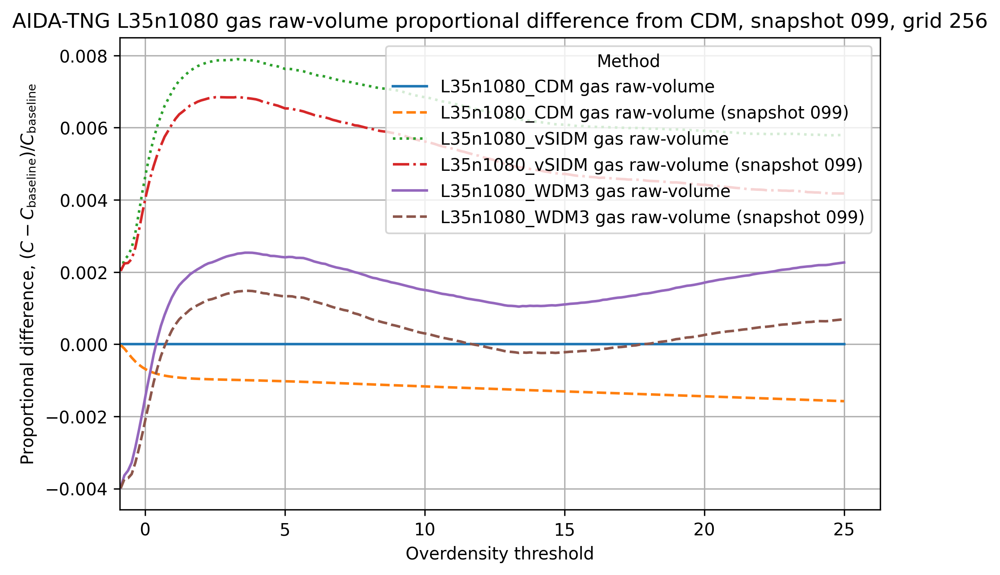
</td>
</tr>
</table>

At `z = 0`, clumping is much larger overall. The relative plot is the more
important physical view because it asks whether model differences survive after
removing the common structure-growth trend.

<table>
<tr>
<td width="50%" align="center">
<strong>L75n910 snapshot 099: grid 256</strong><br>
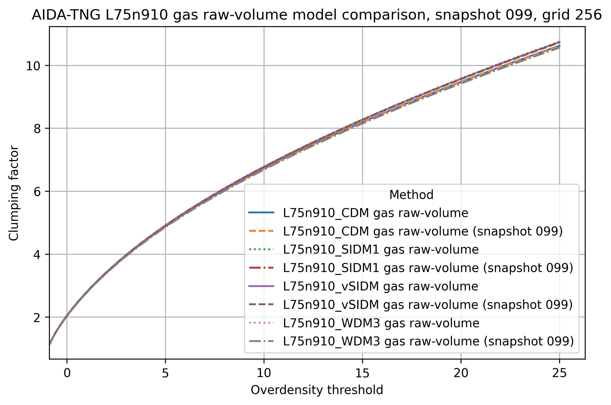
</td>
<td width="50%" align="center">
<strong>L75n910 snapshot 099: grid 512</strong><br>
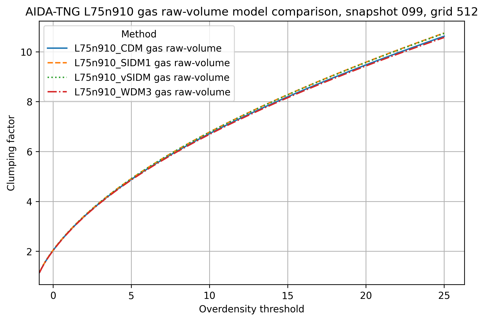
</td>
</tr>
</table>

The L75n910 plots add a second volume/resolution family. This matters because a
dark-matter-model claim should not depend on one box alone.

Representative raw-volume `C20` values:

| Simulation | Snapshot | Redshift | `C20` |
|---|---:|---:|---:|
| L35n1080_CDM | 017 | 4.999 | 2.975 |
| L35n1080_SIDM1 | 017 | 4.999 | 2.985 |
| L35n1080_WDM3 | 017 | 4.999 | 2.905 |
| L35n1080_vSIDM | 017 | 4.999 | 2.987 |
| L35n1080_CDM | 099 | 0.000 | 9.225 |
| L35n1080_WDM3 | 099 | 0.000 | 9.240 |
| L35n1080_vSIDM | 099 | 0.000 | 9.279 |
| L75n910_CDM | 099 | 0.000 | 9.472 |
| L75n910_SIDM1 | 099 | 0.000 | 9.581 |
| L75n910_WDM3 | 099 | 0.000 | 9.430 |
| L75n910_vSIDM | 099 | 0.000 | 9.567 |

## 8. AIDA-TNG ionization views

The density-only model comparisons are only one layer. The ionization and
raw-volume plots ask whether model differences become clearer when the gas is
filtered by ionization or measured with native cell volumes.

<table>
<tr>
<td width="50%" align="center">
<strong>Ionized sweep: model comparison</strong><br>
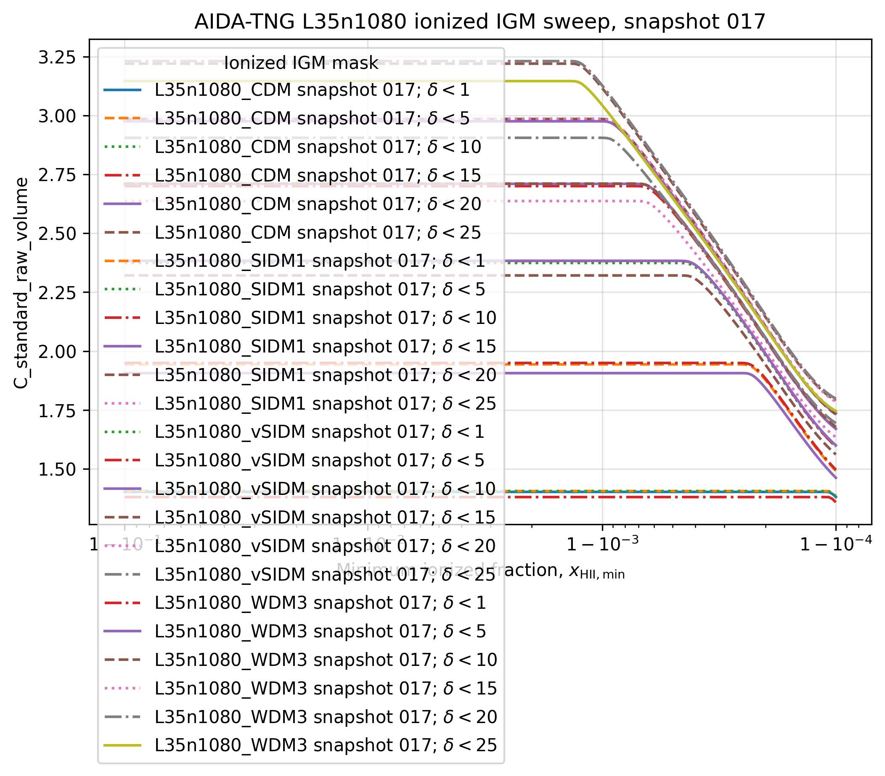
</td>
<td width="50%" align="center">
<strong>Ionized sweep: relative to CDM</strong><br>
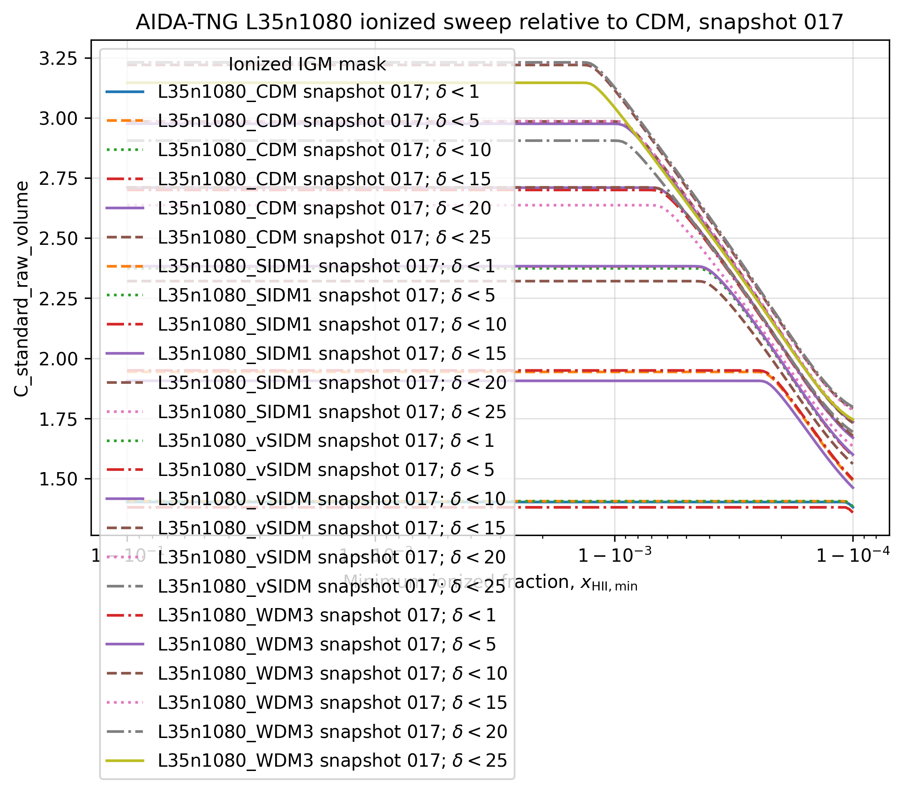
</td>
</tr>
<tr>
<td width="50%" align="center">
<strong>Ionized sweep panels</strong><br>

</td>
<td width="50%" align="center">
<strong>Relative ionized-sweep panels</strong><br>

</td>
</tr>
</table>

These are the more physically promising AIDA-TNG plots because they begin to
separate total gas density from the ionized IGM gas relevant to reionization and
absorption.

<table>
<tr>
<td width="33%" align="center">
<strong>L35 raw-volume comparison</strong><br>

</td>
<td width="33%" align="center">
<strong>L35 raw-volume relative to CDM</strong><br>
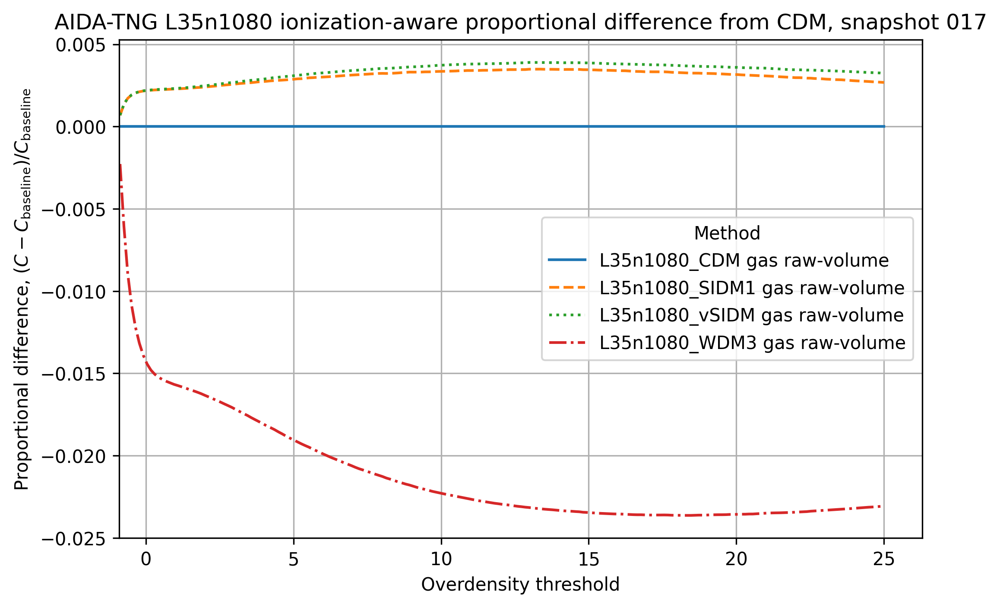
</td>
<td width="33%" align="center">
<strong>L35 raw-volume ionization sweep</strong><br>

</td>
</tr>
</table>

The raw-volume view keeps the moving-mesh volume measure. If the goal is an IGM
volume average, these plots are closer to the desired physical averaging than
equal-cell or purely gridded density moments.

<table>
<tr>
<td width="33%" align="center">
<strong>L75 raw-volume comparison</strong><br>

</td>
<td width="33%" align="center">
<strong>L75 raw-volume relative to CDM</strong><br>
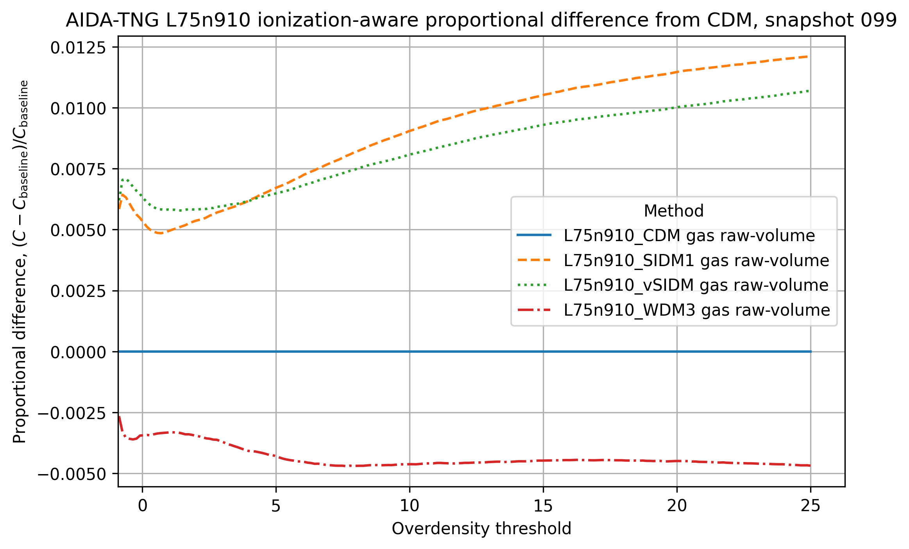
</td>
<td width="33%" align="center">
<strong>L75 raw-volume ionization sweep</strong><br>

</td>
</tr>
</table>

This second model family is useful as a check on whether the ionization-aware
patterns are robust across simulation volume/resolution choices.

## 9. Alternative clumping and observationally motivated quantities

The alternative Eq. 13 campaign was introduced to connect the simulation
analysis to observationally motivated clumping estimates. This is less about the
raw mass-density field and more about the form in which clumping enters
reionization and absorption equations.

<table>
<tr>
<td align="center">
<strong>Eq. 13 clumping vs redshift</strong><br>
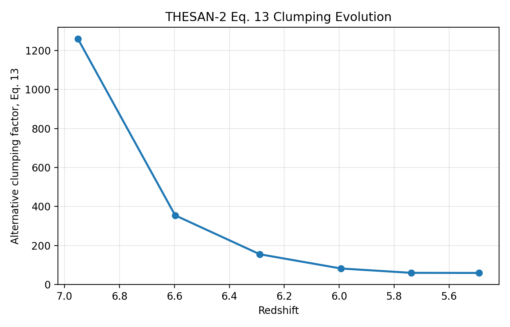
</td>
</tr>
</table>

This figure is part of the transition from "clumping as density variance" to
"clumping as an ingredient in an observational or reionization equation."

JSON products:

- [Snapshot 055 Eq. 13](../results/Thesan-2/alternative_clumping/snapshot055_eq13.json)
- [Snapshot 060 Eq. 13](../results/Thesan-2/alternative_clumping/snapshot060_eq13.json)
- [Snapshot 065 Eq. 13](../results/Thesan-2/alternative_clumping/snapshot065_eq13.json)
- [Snapshot 070 Eq. 13](../results/Thesan-2/alternative_clumping/snapshot070_eq13.json)
- [Snapshot 075 Eq. 13](../results/Thesan-2/alternative_clumping/snapshot075_eq13.json)
- [Snapshot 080 Eq. 13](../results/Thesan-2/alternative_clumping/snapshot080_eq13.json)

## 10. Forest, Gamma, and MFP products

The Lyman-alpha forest direction is the observational bridge. Observations do
not measure the full 3D density field directly; they measure absorption along
lines of sight. The forest, Gamma, and MFP products therefore connect the
clumping project to quantities closer to reionization data.

Current Thesan-1 snapshot 080 scalar products:

| Quantity | Value | Notes |
|---|---:|---|
| `Gamma_HI` | `4.1228e-13 s^-1` | Volume-weighted `HI_Fraction < 0.5` calculation. |
| MFP at 912 Angstrom | `4.6868 proper Mpc / h` | Mean over 15000 ray samples. |
| MFP median | `4.4674 proper Mpc / h` | Same ray sample. |
| MFP 16th-84th interval | `1.3812` to `7.8003 proper Mpc / h` | Broad line-of-sight variation. |

Products:

- [Gamma HI JSON](../results/forest/thesan/Thesan-1/snapshot080/gamma_hi.json)
- [MFP 912 JSON](../results/forest/thesan/Thesan-1/snapshot080/mfp912/rays_080_mfp912.json)
- [Lyman-alpha spectra HDF5](../results/forest/thesan/Thesan-1/snapshot080/lya/rays_080_lya.hdf5)

## 11. Performance plots that matter for the physics campaign

These plots are not the scientific endpoint, but they explain why the project
could move from toy calculations to multi-snapshot physical comparisons.

<table>
<tr>
<td width="50%" align="center">
<strong>Grid scaling</strong><br>
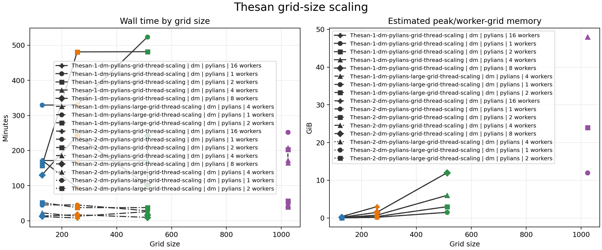
</td>
<td width="50%" align="center">
<strong>Performance dashboard</strong><br>

</td>
</tr>
</table>

The practical outcome is that the same estimator can be run across redshifts,
grids, and models. That consistency is what makes the physical comparisons
above interpretable.

<table>
<tr>
<td align="center">
<strong>Clumping consistency across grids</strong><br>

</td>
</tr>
</table>

This is the most physics-relevant performance-era plot: it checks whether
changes in grid resolution alter the inferred clumping trend.

## 12. What the plot sequence says

The plots tell a staged story:

1. Density clumping grows with cosmic structure formation.
2. Gas and dark matter must be treated as different physical tracers.
3. Gridded gas and Pylians agree when they implement the same density statistic.
4. Native gas-volume weighting gives larger gas clumping, so the averaging
   measure is physically important.
5. Ionization-aware diagnostics move the project beyond density variance toward
   recombination and reionization physics.
6. AIDA-TNG model differences are modest in the simplest density statistic, so
   the stronger test is likely in ionization-aware or observationally connected
   quantities.
7. Forest, Gamma, and MFP products are the bridge from simulation fields to
   absorption-era observables.

The current best interpretation is that the original density clumping factor is
a necessary baseline, but not the final physical observable. The project is now
positioned to compare dark matter models using statistics that know about gas
volume, ionization state, recombination physics, and observational absorption
probes.
